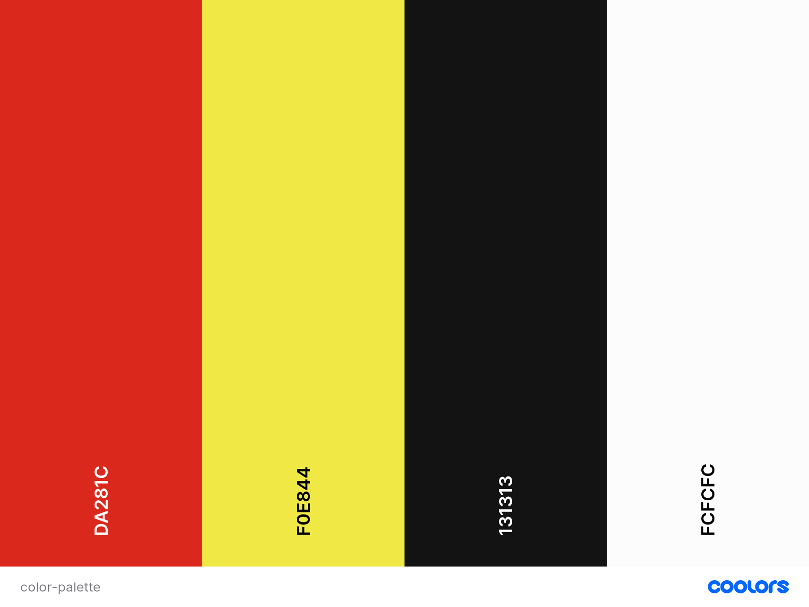

# **The Scuderia Ferrari F1**

## **Goal for this project**

This website is for those who support  the myth and legend of the Scuderia Ferrari. No other Formula 1 team carried the history, the passion nor the romance that this great team does. It is a machine that consumes you. It is a family that embraces and protects you.

The Scuderia Ferrari F1 will make fans filter car by year, find information related to drivers, emgine size, races won and images.

--- 

## Table of contents 
* [UX](#ux)
    * [User Goals](#user-goals)
    * [User Stories](#user-stories)
    * [Site Owners Goals](#site-owners-goals)
    * [User Requirements and Expectations](#user-requirements-and-expectations)
        * [Requirements](#requirements)
        * [Expectations](#expectations)
    * [Design Choices](#design-choices)
        * [Fonts](#fonts)
        * [Colors](#colors)
        * [Structure](#structure)
* [Wireframes and Flowcharts](#wireframes-and-flowcharts)
    * [Wireframes](#wireframes)
    * [Flowcharts](#flowcharts)
    * [Database Structure](#database-structure)
* [Features](#features)
    * [Existing Features](#existing-features)
    * [Features to be implemented](#features-to-be-implemented)
* [Technologies used](#technologies-used)
    * [Languages](#languages)
    * [Libraries and Frameworks](#libraries-and-frameworks)
    * [Tools](#tools)
* [Testing](#testing)
* [Deployment](#deployment)
    * [Local Deployment](#local-deployment)
    * [Heroku Deployment](#heroku-deployment)
* [Credits](#credits)

--- 

## **UX**

### **User Goals**

* The website has to work well on all kind of devices like mobile phones, tables and desktops.
* I want to have the possibility to filter f1 cars by year.
* I want to see car spec. and picture of the model.
*  The website has to be easy to use.
* I would like to read a brief story by each f1 car.

[Back to Top](#table-of-contents)

### **User Stories**

* As a user, I would like to be able to register for the webiste and have my personal environment.
* As a user, I would like to login after I created my account and see previous inserted information about F1 car.
* As a user, I would like to have my persoanl profile with favourite car.
* As a user, I want to be able to add car specs, race results, drivers and images for a specific car.
* As a user, I would like to have a dashboard where I can  have a good overview.
* As a user, i want to be able to search Ferrari F1 car by year to get specific car information.
* As a user, I want to be able to add many cars information I want.
* As a user, I want to have the possibility to edit info added or want to add/delete some info.
* As a user, I want the website to be easy to use.
* As a user, I want the process to add / edit / delete info to be easy.

### **Site owners Goals**

* To have an appealing website that Ferrari fans use to search their best car model, fast lap, race won ecc.
* To have a great functionality and helps users to spend time on reading and looking info about their favourite F1 car.
* To make the would personal by giving the user the possibility to add relevant information.

[Back to Top](#table-of-contents)

### **User Requirements and Expectations**

### Requirements

* Easy to navigate by using the few buttons.
* Nice dashboard with a functional overview.
* Easy way to add a car info to the dashboard.
* Easy way to search other users car.
* Ability to edit and delete existing cars information.

### Expectations

* When you have multiple cars, it should be easy to navigate between them.
* To have a dashboard where all the necessary information is visible.
* It should be easy to edit or add another car.
* To be able to filter cars by years.

[Back to Top](#table-of-contents)

### **Design Choices**

I have used [Coolors](https://coolors.co/ "Coolors.co") to come up with a color scheme that matches the Ferrari F1 Team. I have decided to keep the design, the background will be white and  just recall Ferrari logo colors for buttons and navigation. The reason for this is because for this project the functionalities is more important.

#### Fonts

I have visited [Google fonts](https://fonts.google.com/) to explore and find the appropriate fonts to use. I have decide to use [Maven Pro](https://fonts.google.com/specimen/Maven+Pro) for the main text.

#### Structure

Yo create the website structure I decide to use [Materialize](https://materializecss.com/).  Materialize provides various elements of CSS and Javascript which is very helpful to keep a good structure on your page and they offer various features like floating action button, Navbar, Tables etc.

[Back to Top](#table-of-contents)

---

## **Wireframes and Flowcharts**

#### Wireframes

I used [Balsamic](https://balsamiq.com/wireframes/) to create wireframes for my website.

See my wireframes below:

* [Home](wireframes/home.jpg)

### **Desktop Wireframes**

* [Dashboard](wireframes/desktop-dashboard.jpg)
* [Add Car](wireframes/desktop-addcar.jpg)

### **Tablet Wireframes**

* [Dashboard](wireframes/tablet-dashboard.jpg)
* [Add Car](wireframes/tablet-addcar.jpg)

### **Mobile Wireframes**

* [Dashboard](wireframes/mobile-dashboard.jpg)
* [Add Car](wireframes/mobile-addcar.jpg)

#### Flowcharts